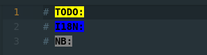

<!----------------------------------------------------------------------------->
<!-- Filename: README.md                                       /          \  -->
<!-- Project : language-comments-plus                         |     ()     | -->
<!-- Date    : 06/02/2022                                     |            | -->
<!-- Author  : Dana Hynes                                     |   \____/   | -->
<!-- License : WTFPLv2                                         \          /  -->
<!----------------------------------------------------------------------------->

# language-comments-plus
## "It mostly works™"

A highlighter for tokens in comments

# Use
Install it, and it will highlight the tokens it finds, e.g.:

# Configuration:
1. On Linux, open ~/.atom/packages/language-comments-plus\
(Not sure of the location on Mac/Windows)

1. Open /grammars/grammars.cson\
Add your tokens to the two places you see existing tokens, separated by "|"\
(the lines that start with "match:")

1. Open /styles/styles.less\
Follow the comments to add new colors

1. Open /snippets/snippets.cson\
Follow the comments to add new snippets

# -)

<!-- -) -->
